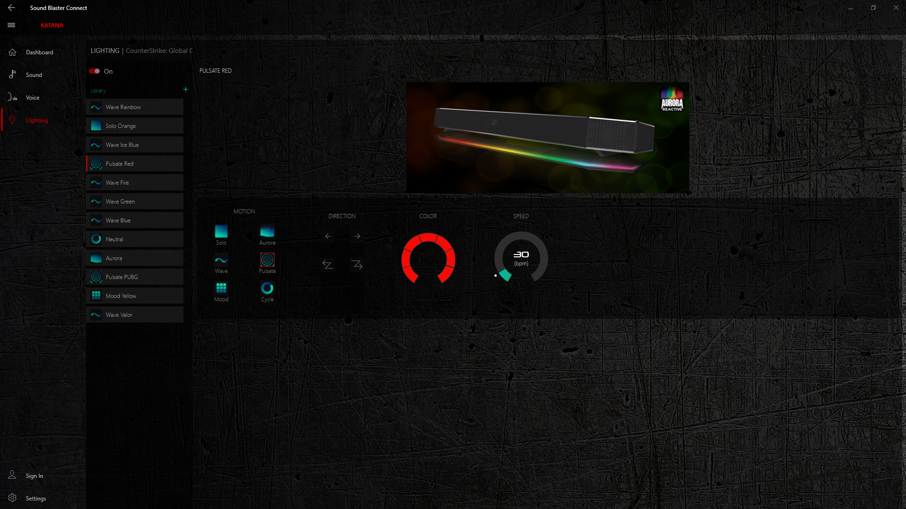
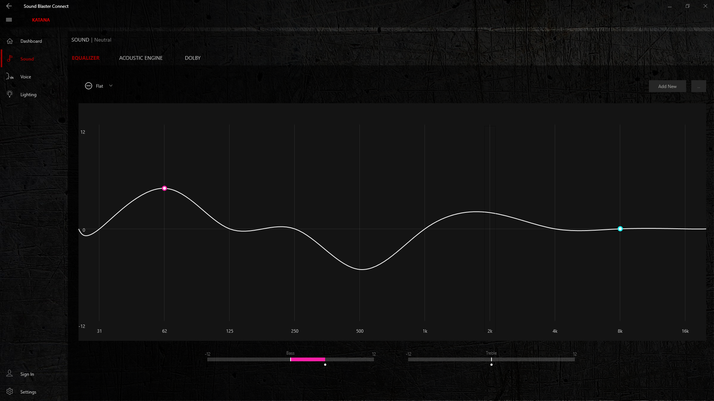

# Sound BlasterX Katana: Navigating Audio Precision and User Feedback

---

Stevie Littleton, 11/21/2024

---
 
  

---

### **Goals**
I wanted to configure the [Sound BlasterX Katana](https://us.creative.com/p/speakers/sound-blasterx-katana) to enhance my gaming and movie-watching experience. My goals included connecting the system to my PC, customizing the equalizer settings for better sound, and exploring RGB lighting options.

### **Interaction**
Initially, I used the remote control to adjust the settings, but I quickly realized that accessing the Sound Blaster Command software on my PC provided more advanced customization options. I explored the equalizer settings, preset modes, and RGB lighting configurations through the app. The interaction felt intuitive at first because of the layout.

### **Outcome**
I was able to achieve a good balance of sound and lighting settings, but I encountered minor difficulties in navigating the app’s menu, especially when trying to save my presets.

### **Assessment**
- **Positive Aspects**:
  - The Sound Blaster Command software utilizes the **visibility of system status** principle by providing real-time feedback when changes are made (e.g., sliders update the audio immediately).
  - The RGB customization aligns well with the **"aesthetic and minimalist design"** principle, offering clear sections for lighting and sound.
  

- **Challenges**:
  - The menu navigation contradicted my **mental model** of how such interfaces usually work, as it lacked clear "Save Preset" options.
  - The feedback provided during preset saving was inconsistent and caused some confusion.

- **Unique Term**:  
  **Mental Model**: A user’s mental model refers to their internal understanding of how a system should work based on prior experiences. My mental model expected a clear 'Save' button to store settings, which did not match the system's implementation.

### **Suggestions for Improvement**
- Add a dedicated "Save" button or prompt after making changes.
- Simplify the menu hierarchy to make frequently used options more accessible.
- Provide a brief tutorial or tooltip feature for first-time users of the app.

---

Overall, the Sound BlasterX Katana delivers a rich audio and visual experience, but minor usability issues with the software can detract from the overall user experience. Addressing these challenges would make the product more user-friendly for both novice and experienced users.
